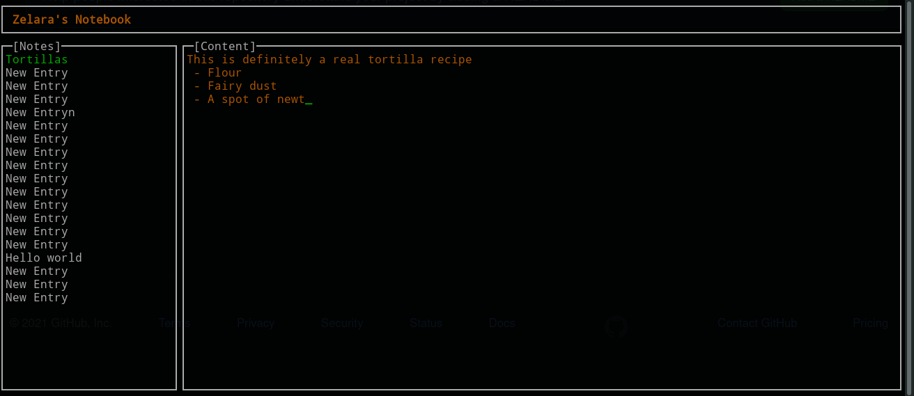

A note taking TUI that backs up to a SQL server written in Go and PHP for fun. 

**Configuration**

Create a local or remote server and add a SQL database with the table found in the PHP files. Upload PHP files to server. Then in the same directory as the binary create a file 'url.txt' containing the url of the server, e.g. http://localhost/

**Usage**

Globally:
 - Ctrl-C to exit.

In the browser tab (left side):
 - 'Enter' to edit entry
 - 'Up'/'Down' arrows to scroll
 - 'n' create new entry
 - 'e' edit entry title
 - 'd' delete entry

In the editor tab (right side):
 - 'Escape' return to browser tab
